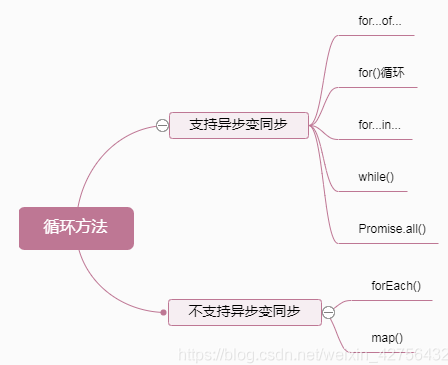

## 请做一下自我介绍

**回答：** 面试官你好,我叫xxx,巴拉巴拉
:::details 注意事项
一般人回答这个问题过于平常，只说姓名、年龄、工作经验，这些在简历上都有。其实，企业最希望知道的是求职者能否胜任工作，包括：最强的技能、最深入研究的知识领域、个性中最积极的部分、做过的最成功的事，主要的成就等，要突出积极的个性和做事的能力，说的合情合理企业才会相信。
:::
## 介绍一下你做的项目

**回答：** 首先是xxx项目.我参与了xxx 其中xxx

## HTML

### 1.html语义化
html语义化就是用合适的标签来标记和合适的内容

**语义化的好处** 
- 有利于SEO：和搜索引擎建立良好沟通，有助于爬虫抓取更多的有效信息。
- 方便其他设备（如屏幕阅读器、盲人阅读器、移动设备）更好的解析页面。
- 使代码更具可读性，便于团队开发和维护
- 网页加载慢导致CSS文件还未加载时（没有CSS），页面仍然清晰、可读、好看

**语义化标签**
- `header footer nav`(导航链接区域)
- `aside` 通常被包含在article元素中作为主要内容的附属信息部分
- `section` section元素代表文档中的“节”或“段”
- `article` article代表一个在文档，页面或者网站中自成一体的内容,比如论坛帖子
- `h1 - h6` 标题，根据级别依次递减 h1一个页面最好只有一个
- `p` 内容段落

### 2.行内元素和块级元素
**行内元素**
- 不会独占一行,相邻的行内元素会排列在同一行里,直到一行排不下,才会换行
- 行内元素设置width,height属性无效
- 行内元素的margin和padding只在水平方向有效果

> 标签：a img input label select strong textarea

**块级元素**

- 会独占一行,默认情况下,其宽度自动填满其父元素宽度
- 块级元素可以设置width,height属性.
- 块级元素即使设置了宽度,仍然是独占一行.
- 块级元素可以设置margin和padding属性

> 标签： div p form h1-h6 ul ol

**行内块级元素**

结合的行内和块级的优点，既可以设置长宽，可以让padding和margin生效，又可以和其他行内元素并排


### 3.meta标签

`<meta>` 标签提供关于 HTML 文档的元数据。它不会显示在页面上，但是对于机器是可读的。可用于浏览器（如何显示内容或重新加载页面），搜索引擎（关键词），或其他 web 服务

``` html
// 声明文档编码
<meta charset="utf-8">
//页面关键字
<meta name="keywords" content="your keywords">
// 页面描述内容
<meta name="description" content="your description">
// 定义网页作者
<meta name="author" content="author,email address">
//移动端布局参数设置
<meta name="viewport" content="width=device-width, initial-scale=1.0">
content参数如下：
-   width viewport 宽度(数值/device-width)
-   height viewport 高度(数值/device-height)
-   initial-scale 初始缩放比例
-   maximum-scale 最大缩放比例
-   minimum-scale 最小缩放比例
-   user-scalable 是否允许用户缩放(yes/no)
//各个浏览器的meta标签有不同的自定义功能 包括 chrome 360 UC 等等

<!-- 优先使用最新的chrome版本 --> 
<meta http-equiv="X-UA-Compatible" content="chrome=1" /> 
<!-- 禁止自动翻译 -->
<meta name="google" value="notranslate">

```

### 4.script 标签中 defer 和 async 的区别？
- `script` ：会阻碍 HTML 解析，只有下载好并执行完脚本才会继续解析 HTML。
- `async script` ：解析 HTML 过程中进行脚本的异步下载，下载成功立马执行，有可能会阻断 HTML 的解析。
- `defer script`：完全不会阻碍 HTML 的解析，解析完成之后再按照顺序执行脚本

## CSS

### 1. 盒模型
CSS3 中的盒模型有以下两种：标准盒模型、IE（替代）盒模型。
两种盒子模型都是由 `content + padding + border + margin` 构成，其大小都是由` content + padding + border` 决定的，但是盒子内容宽/高度（即 width/height）的计算范围根据盒模型的不同会有所不同：

标准盒模型：只包含 `content `。

IE（替代）盒模型：`content + padding + border `。

可以通过` box-sizing `来改变元素的盒模型：

- `box-sizing: content-box` ：标准盒模型（默认值）。
- `box-sizing: border-box` ：IE（替代）盒模型。

### 2. 重排（reflow）和重绘（repaint）的理解
**简单地总结下两者的概念：** 
* 重排：无论通过什么方式影响了元素的几何信息(元素在视口内的位置和尺寸大小)，浏览器需要重新计算元素在视口内的几何属性，这个过程叫做重排。
* 重绘：通过构造渲染树和重排（回流）阶段，我们知道了哪些节点是可见的，以及可见节点的样式和具体的几何信息(元素在视口内的位置和尺寸大小)，接下来就可以将渲染树的每个节点都转换为屏幕上的实际像素，这个阶段就叫做重绘

**如何减少重排和重绘？**
* 最小化重绘和重排，比如样式集中改变，使用添加新样式类名 .class 或 cssText 。
* 批量操作 DOM，比如读取某元素 offsetWidth 属性存到一个临时变量，再去使用，而不是频繁使用这个计算属性；又比如利用 document.createDocumentFragment() 来添加要被添加的节点，处理完之后再插入到实际 DOM 中。
* 使用 **absolute** 或 **fixed** 使元素脱离文档流，这在制作复杂的动画时对性能的影响比较明显。
* 开启 GPU 加速，利用 css 属性 transform 、will-change 等，比如改变元素位置，我们使用 translate 会比使用绝对定位改变其 left 、top 等来的高效，因为它不会触发重排或重绘，transform 使浏览器为元素创建⼀个 GPU 图层，这使得动画元素在一个独立的层中进行渲染。当元素的内容没有发生改变，就没有必要进行重绘。

### 3. 对 BFC 的理解
BFC 即块级格式上下文，根据盒模型可知，每个元素都被定义为一个矩形盒子，然而盒子的布局会受到尺寸，定位，盒子的子元素或兄弟元素，视口的尺寸等因素决定，所以这里有一个浏览器计算的过程，计算的规则就是由一个叫做视觉格式化模型的东西所定义的，BFC 就是来自这个概念，它是 CSS 视觉渲染的一部分，**用于决定块级盒的布局及浮动相互影响范围的一个区域。**

BFC 具有一些特性：

1. 块级元素会在垂直方向一个接一个的排列，和文档流的排列方式一致。
2. 在 BFC 中上下相邻的两个容器的 margin  会重叠，创建新的 BFC 可以避免外边距重叠。
3. 计算 BFC 的高度时，需要计算浮动元素的高度。
4. BFC 区域不会与浮动的容器发生重叠。
5. BFC 是独立的容器，容器内部元素不会影响外部元素。
6. 每个元素的左 margin  值和容器的左 border  相接触。

利用这些特性，我们可以解决以下问题：

* 利用 4  和 6 ，我们可以实现三栏（或两栏）自适应布局。
* 利用 2 ，我们可以避免 margin  重叠问题。
* 利用 3 ，我们可以避免高度塌陷。

创建 BFC 的方式：

* 绝对定位元素（position 为 absolute 或 fixed ）。
* 行内块元素，即 display 为 inline-block 。
* overflow 的值不为 visible 。

### 4. 水平垂直居中多种实现方式
1. 利用绝对定位，设置 left: 50%  和 top: 50%  现将子元素左上角移到父元素中心位置，然后再通过 translate  来调整子元素的中心点到父元素的中心。该方法可以不定宽高。

``` css
.father {
  position: relative;
}
.son {
  position: absolute;
  left: 50%;
  top: 50%;
  transform: translate(-50%, -50%);
}
```

2. 利用绝对定位，子元素所有方向都为 0 ，将 margin  设置为 auto ，由于宽高固定，对应方向实现平分，该方法必须盒子有宽高。
``` css
.father {
  position: relative;
}
.son {
  position: absolute;
  top: 0;
  left: 0;
  right: 0;
  bottom: 0px;
  margin: auto;
  height: 100px;
  width: 100px;
}

```

3. 利用绝对定位，设置 left: 50% 和 top: 50% 现将子元素左上角移到父元素中心位置，然后再通过 margin-left  和 margin-top  以子元素自己的一半宽高进行负值赋值。**该方法必须定宽高**。
``` css
.father {
  position: relative;
}
.son {
  position: absolute;
  left: 50%;
  top: 50%;
  width: 200px;
  height: 200px;
  margin-left: -100px;
  margin-top: -100px;
}
```

4. 利用 flex ，最经典最方便的一种了，不用解释，定不定宽高无所谓的。
``` css
.father {
  display: flex;
  justify-content: center;
  align-items: center;
}
```

## JavaScript   

### 1. js都有哪些数据类型,他们的区别

::: tip
JavaScript目前有八种数据类型,分别是`undefined,nul,boolean,number,string,object,symbol,bigint`,其中symbol和bigint是ES6新增的数据类型
:::
* symbol: 代表创建后独一无二且不可变的数据类型,它主要是为了解决可能出现的全局变量冲突的问题。
* bigint: 是一种数字类型的数据，它可以表示任意精度格式的整数，使用 BigInt 可以安全地存储和操作大整数，即使这个数已经超出了 Number 能够表示的安全整数范围

**这些数据可以分为原始数据类型和引用数据类型：**

* 栈：原始数据类型（Undefined、Null、Boolean、Number、String）
* 堆：引用数据类型（对象、数组和函数）

**两种类型的区别在于存储位置的不同：**

* 原始数据类型直接存储在栈（stack）中的简单数据段，占据空间小、大小固定，属于被频繁使用数据，所以放入栈中存储；
* 引用数据类型存储在堆（heap）中的对象，占据空间大、大小不固定。如果存储在栈中，将会影响程序运行的性能；引用数据类型在栈中存储了指针，该指针指向堆中该实体的起始地址。当解释器寻找引用值时，会首先检索其在栈中的地址，取得地址后从堆中获得实体。

**堆和栈的概念存在于数据结构和操作系统内存中，在数据结构中：**

* 在数据结构中，栈中数据的存取方式为先进后出。
* 堆是一个优先队列，是按优先级来进行排序的，优先级可以按照大小来规定。

### 2. 数据类型检测的方式有哪些

::: tip
常用的有`typeof`, `instanceof`, `constructor`, `Object.prototype.toString.call()`
:::

* 使用 `typeof` 判断类型,其中数组、对象、null都会被判断为object，其他判断都正确。
``` js
console.log(typeof 2);               // number
console.log(typeof true);            // boolean
console.log(typeof 'str');           // string
console.log(typeof []);              // object    
console.log(typeof function(){});    // function
console.log(typeof {});              // object
console.log(typeof undefined);       // undefined
console.log(typeof null);            // object
```

* 使用 `instanceof` 可以正确判断对象的类型，其内部运行机制是判断在其原型链中能否找到该类型的原型。  
``` js
console.log(2 instanceof Number);                    // false
console.log(true instanceof Boolean);                // false 
console.log('str' instanceof String);                // false 
console.log([] instanceof Array);                    // true
console.log(function(){} instanceof Function);       // true
console.log({} instanceof Object);                   // true
```
::: warning 
可以看到，**instanceof只能正确判断引用数据类型，而不能判断基本数据类型。** instanceof 运算符可以用来测试一个对象在其原型链中是否存在一个构造函数的 prototype 属性
:::

* 使用 `constructor` 有两个作用，一是判断数据的类型，二是对象实例通过 `constrcutor` 对象访问它的构造函数。
``` js
console.log((2).constructor === Number); // true
console.log((true).constructor === Boolean); // true
console.log(('str').constructor === String); // true
console.log(([]).constructor === Array); // true
console.log((function() {}).constructor === Function); // true
console.log(({}).constructor === Object); // true
```

::: details 需要注意，如果创建一个对象来改变它的原型，constructor就不能用来判断数据类型了
``` js
function Fn(){};
 
Fn.prototype = new Array();
 
var f = new Fn();
 
console.log(f.constructor===Fn);    // false
console.log(f.constructor===Array); // true

```
:::

* `Object.prototype.toString.call()`: 使用 Object 对象的原型方法 toString 来判断数据类型：

``` js
var a = Object.prototype.toString;
console.log(a.call(2)); // [object Number]
console.log(a.call(true)); // [object Boolean]
console.log(a.call('str')); // [object String]
console.log(a.call([])); // [object Array]
console.log(a.call(function(){})); // [object Function]
console.log(a.call({})); // [object Object]
console.log(a.call(undefined)); // [object Undefined]
console.log(a.call(null)); // [object Null]
```
::: details 知识点
同样是检测对象obj调用toString方法，obj.toString()的结果和Object.prototype.toString.call(obj)的结果不一样，这是为什么？   
这是因为toString是Object的原型方法，而Array、function等类型作为Object的实例，都重写了toString方法。不同的对象类型调用toString方法时，根据原型链的知识，调用的是对应的重写之后的toString方法（function类型返回内容为函数体的字符串，Array类型返回元素组成的字符串…），而不会去调用Object上原型toString方法（返回对象的具体类型），所以采用obj.toString()不能得到其对象类型，只能将obj转换为字符串类型；因此，在想要得到对象的具体类型时，应该调用Object原型上的toString方法。
:::

### 3. 判断数组的方式有哪些
::: tip
通过Object.prototype.toString.call()做判断,通过原型链做判断,通过ES6的Array.isArray()做判断,通过instanceof做判断,通过Array.prototype.isPrototypeOf做判断
:::

* 通过Object.prototype.toString.call()做判断
``` js
Object.prototype.toString.call(obj).slice(8,-1) === 'Array';
```

* 通过原型链做判断
``` js
obj.__proto__ === Array.prototype;
```

* 通过ES6的Array.isArray()做判断
``` js
Array.isArrray(obj);
```

* 通过instanceof做判断
``` js
obj instanceof Array;
```

* 通过Array.prototype.isPrototypeOf做判断
``` js
Array.prototype.isPrototypeOf(obj)
```

### 4. null和undefined的区别
首先 `Undefined` 和 `Null` 都是基本数据类型，这两个基本数据类型分别都只有一个值，就是 `undefined` 和 `null。`   
`undefined` 代表的含义是**未定义**, `null` 代表的含义是**空对象**   
一般变量声明了但还没有定义的时候会返回 undefined，null主要用于赋值给一些可能会返回对象的变量，作为初始化。    
undefined 在 JavaScript 中不是一个保留字，这意味着可以使用 undefined 来作为一个变量名，但是这样的做法是非常危险的，它会影响对 undefined 值的判断。我们可以通过一些方法获得安全的 undefined 值，比如说 void 0。   
当对这两种类型使用 typeof 进行判断时，Null 类型化会返回 “object”，这是一个历史遗留的问题。当使用双等号对两种类型的值进行比较时会返回 true，使用三个等号时会返回 false。   


### 5. instanceof 操作符的实现原理及实现
``` js
function myInstanceof(left, right) {
  // 获取对象的原型
  let proto = Object.getPrototypeOf(left)
  // 获取构造函数的 prototype 对象
  let prototype = right.prototype; 
 
  // 判断构造函数的 prototype 对象是否在对象的原型链上
  while (true) {
    if (!proto) return false;
    if (proto === prototype) return true;
    // 如果没有找到，就继续从其原型上找，Object.getPrototypeOf方法用来获取指定对象的原型
    proto = Object.getPrototypeOf(proto);
  }
}
```

### 6. Object.is() 与比较操作符 “===”、“==” 的区别？
* 使用双等号（==）进行相等判断时，如果两边的类型不一致，则会进行强制类型转化后再进行比较。
* 使用三等号（===）进行相等判断时，如果两边的类型不一致时，不会做强制类型准换，直接返回 false。
* 使用 Object.is 来进行相等判断时，一般情况下和三等号的判断相同，它处理了一些特殊的情况，比如 -0 和 +0 不再相等，两个 NaN 是相等的。

### 7. 什么是 JavaScript 中的包装类型？
在 JavaScript 中，基本类型是没有属性和方法的，但是为了便于操作基本类型的值，在调用基本类型的属性或方法时 JavaScript 会在后台隐式地将基本类型的值转换为对象，如下：
``` js
const a = "abc"; // 基本类型
a.length; // 3
a.toUpperCase(); // "ABC"
```
在访问`'abc'.length`时，JavaScript 将'abc'在后台转换成`String('abc')`，然后再访问其length属性。   
JavaScript也可以使用Object函数显式地将基本类型转换为包装类型：
``` js
var a = 'abc'
Object(a) // String {"abc"}
```
也可以使用valueOf方法将包装类型倒转成基本类型：
::: tip 
Object.prototype.valueOf() 将对象转换为原始值,你很少会使用到该方法   
:::
``` js
var a = 'abc'
var b = Object(a)
var c = b.valueOf() // 'abc'
```
::: details 小测试
思考下列代码会打印什么?
``` js
var a = new Boolean( false );
if (!a) {
	console.log( "Oops" ); // never runs
}
```
答案: 什么都不会打印,因为Boolean类型被转换为对象,值不是false,所以不会执行if语句
:::

### 8. new操作符的实现原理

**new操作符的执行过程**
1. 首先创建了一个新的空对象
2. 将对象的隐式原型 `__proto__` 指向构造函数的显示原型 `prototype` 对象。
3. 执行构造函数,为这个新对象添加属性,让this 指向这个对象
4. 返回这个新对象

::: details 具体实现
常规版本
``` js
function objectFactory() {
  let newObject = null;
  let constructor = Array.prototype.shift.call(arguments);
  let result = null;
  // 判断参数是否是一个函数
  if (typeof constructor !== "function") {
    console.error("type error");
    return;
  }
  // 新建一个空对象，对象的原型为构造函数的 prototype 对象
  newObject = Object.create(constructor.prototype);
  // 将 this 指向新建对象，并执行函数
  result = constructor.apply(newObject, arguments);
  // 判断返回对象
  let flag = result && (typeof result === "object" || typeof result === "function");
  // 判断返回结果
  return flag ? result : newObject;
}
// 使用方法
objectFactory(构造函数, 初始化参数);

```
简易版本
``` js
function myNew(fn, ...args) {
  // 创建了一个新的空对象
  const obj = Object.create(fn.prototype);
  // 将对象的隐式原型 `__proto__` 指向构造函数的显示原型 `prototype` 对象
  obj.__proto__ = fn.prototype;
  // 执行构造函数,为这个新对象添加属性,让this 指向这个对象
  fn.apply(obj, args);
  // 返回这个新对象
  return obj;
}
```
:::

### 9. map 和 object 的区别
|  区别   |   map     |    object   |
| ------  |  ------   |  -------   |
| 键的类型 | Map的键可以是任意值，包括函数、对象或任意基本类型。 | Object 的键必须是 String 或是Symbol。|
| 键的顺序 | Map 中的 key 是有序的。因此，当迭代的时候， Map 对象以插入的顺序返回键值。 | Object 的键是无序的 |
| Size | Map 的键值对个数可以轻易地通过size 属性获取 | Object 的键值对个数只能手动计算 |
| 迭代	| Map 是 iterable 的，所以可以直接被迭代。| 迭代Object需要以某种方式获取它的键然后才能迭代。|
| 性能 | 在频繁增删键值对的场景下表现更好。 | 在频繁添加和删除键值对的场景下未作出优化。|

### 10. 数组有哪些原生方法？
* 数组和字符串的转换方法：toString()、toLocalString()、join() 其中 join() 方法可以指定转换为字符串时的分隔符。
* 数组尾部操作的方法 pop() 和 push()，push 方法可以传入多个参数。
* 数组首部操作的方法 shift() 和 unshift() 重排序的方法 reverse() 和 sort()，sort() 方法可以传入一个函数来进行比较，传入前后两个值，如果返回值为正数，则交换两个参数的位置。
* 数组连接的方法 concat() ，返回的是拼接好的数组，不影响原数组。
* 数组截取办法 slice()，用于截取数组中的一部分返回，不影响原数组。
* 数组插入方法 splice()，影响原数组查找特定项的索引的方法，indexOf() 和 lastIndexOf() 迭代方法 every()、some()、filter()、map() 和 forEach() 方法
* 数组归并方法 reduce() 和 reduceRight() 方法

### 11. 数组的遍历方法


| 方法 | 是否改变原数组 | 特点 |
| ---- | ---- | ---- | 
| forEach() | 否 | 数组方法，不改变原数组，没有返回值 |
| map() | 否 | 数组方法, 不改变原数组，有返回值,可链式调用 | 
| filter() | 否 | 数组方法, 过滤数组，返回包含符合条件的元素的数组，可链式调用 |
| for...of | 否 | for...of遍历具有Iterator迭代器的对象的属性,返回的是数组的元素、对象的属性值，不能遍历普通的obj对象，将异步循环变成同步循环|

::: details 知识点
 **循环中的异步同步**   
 开发中经常遇到，遍历去查询服务获取数据，并且后边的代码需要借用上边查询到的数据，但是查询服务是一个异步操作，运用forEach或者map循环，哪怕使用了同步代码(async await)在还没有查询到数据后，就执行了下一步操作，所以就需要使用异步变同步的循环   
   
在支持异步转同步的代码中添加 `async` `await` 等同步代码块 即可实现功能
::: 