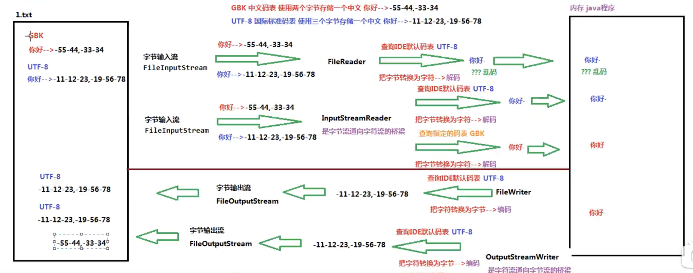

# IO

I: input 输入
O: output 输出
流: 二进制数据

## 字节输出流 Output stream

> java.io 
OutputStream 所有字节输出流的超类,定义了一些共性的方法

### 文件字节输出流 FileOutputStream
> FileOutputStream extends OutputStream
构造方法
1. FileOutputStream(String name) name: 目的地是一个文件的路径
2. FileOutputStream(File file) file: 目的地是一个文件

构造方法的作用
1. 创建FileOutputStream对象
2. 根据构造方法中存底的文件/文件路径,创建一个空的文件
3. 会把FileOutputStream对象指向创建的文件

## 写入数据
写入数据原理(内存=>硬盘)
java程序-> JVM(java虚拟机)->OS操作系统->OS调用写数据方法->写入数据

## **字节输出流的使用步骤(重点)**

1. 创建FileOutputStream对象,构造方法中传递写入数据的目的地
2. 调用FileOutputStream对象中的方法write,数据写入文件
3. 释放资源(流使用会占用内存,使用完清空流,提高效率) close()

``` java
public class IOdemo {
  public static void main(String[] args) throws IOException {
    FileOutputStream fos = new FileOutputStream("a.txt"); // 创建fileoutputstream对象
    fos.write(44);// 写入数据 十进制的数字会转换成而二进制
    fos.close();// 关闭流
  }
}
```

## 一次写多个字节
1. 如果写的第一个字节是正数,显示的时候会查询ASCII表
2. 如果写的第一个字节是负数,第一个字节和第二个字节,组成一个中文显示,查询系统默认码表GBK

``` java

public class IOdemo {
  public static void main(String[] args) throws IOException {
    FileOutputStream fos = new FileOutputStream("b.txt");
    byte[] sz = {-65,-66,-67,68,69};
    fos.write(sz);
    fos.close();
  }
}

```
## 把字节数组的一部分写入文件
write(byte[] b,int off,int len)
off: 数组的开始索引:从哪里开始写
len: 写几个

## 写入字符串的方法
可以用string类中的getBytes()把字符串转换成字节数组
utf-8 3字节是一个中文
GBK 2字节是一个中文

## 数据追加写(续写)和换行写

### 续写 
使用两个参数的构造方法
FileOutputStream(String name,boolean append)   
FileOutputStream(File file,boolean append)   
append:追加写开关 如果是true : 创建对象不会覆盖源文件,会在文件的末尾追加写数据,如果是false: 会创建一个新文件,覆盖源文件,在新文件中写数据

``` java

public class IOdemo {
  public static void main(String[] args) throws IOException {
    FileOutputStream fos = new FileOutputStream("b.txt",true);
    byte[] bytes = "你好".getBytes();
    fos.write(bytes);
    fos.close();
  }
}
```

### 换行写
写换行符号 
\r\n windows   
\r mac系统   
\n linux系统   
``` java
public class IOdemo {
  public static void main(String[] args) throws IOException {
    FileOutputStream fos = new FileOutputStream("b.txt",true);
    byte[] bytes = "你好".getBytes();
    for (int i = 0; i < 10; i++) {
      fos.write(bytes);
      fos.write("\r".getBytes());
    }
    fos.close();
  }
}
```


## 字节输入流
> inputStream 定义了所有子类共性的方法,是个超类,抽象类

## fileInputStream 子类 

作用: 把硬盘中的数据,读取到内存中使用
构造方法:
1. fileInputStream(String name)
2. fileInputStream(File file)
参数是读取文件的数据源,name是文件的路径,file是文件   
构造方法的作用:
1. 创建fileInputStream对象
2. 把fileInputStream对象指向构造方法中要读取的文件
使用步骤:
1. 创建fileInputStream对象,构造方法中板顶要读取的数据源
2. 使用read方法读取文件
3. 释放资源
## 读取
int read() 读取文件中的一个字节并返回,读取到文件末尾返回-1
读文件是一个重复的过程,使用循环优化,不知道循环多少次,使用while循环
循环条件为读取到-1的时候结束

```java
public class Input {
  public static void main(String[] args) throws IOException {
    int ln = 0; //记录读取到的字节
    FileInputStream file = new FileInputStream("a.txt");
    while ((ln = file.read()) != -1){
      System.out.println((char) ln);
    }
  }
}

```
while ((ln = file.read()) != -1) 布尔表达式意思
1. file.read()读取一个字节
2. 赋值给ln
3. 判断len 是否不等于-1
while ((ln = file.read()) != -1)  固定写法 因为每次read() 都会让指针后移一位,所以循环中不能读取,否则就是多次读取

## 字节流输入流一次读取多个字节
> String(byte[] bytes) 把字节数组 转换为字符串
> String(byte[] bytes,int offset int length) 把字节数组的一部分 转换为字符串


``` java
public class Input {
  public static void main(String[] args) throws IOException {
    int ln = 0; //记录读取到的字节
    FileInputStream file = new FileInputStream("a.txt");
    byte[] bytes= new byte[2];
    int read = file.read(bytes);
    System.out.println(read);
    System.out.println(new String(bytes));
  }
}

```
数组起到缓冲作用,存储读取到的多个字节
int read(byte[])
1. 参数byte[]起到缓冲作用,存储每次读取到的多个字节,数组的长度一般定义为1024或者1024的整数倍
2. 返回值int 是每次读取的有效字节数


循环读取多个字节,字节数组转换为有效字符 使用 String(byte[] bytes,int offset int length)
```java
public class Input {
  public static void main(String[] args) throws IOException {
    int ln = 0; //记录读取到的字节
    FileInputStream file = new FileInputStream("a.txt");
    byte[] bytes= new byte[1024];
    while ((ln = file.read(bytes)) != -1 ){
      System.out.println(new String(bytes,0,ln));
    }
  }
}
```
## 文件赋值(一读一写)

需明确
1: 数据源
2: 目的地

``` java
public class Copy {
  public static void main(String[] args) throws IOException {
    FileInputStream fos1 = new FileInputStream("a.txt");
    FileOutputStream fos2 = new FileOutputStream("/Users/sroxck/Pictures/b.txt");
    int len = 0;
    while ((len = fos1.read()) != -1){
      fos2.write(len);
    }
    fos2.close();
    fos1.close();
  }
}
```
上面代码的问题,效率慢,一个字节一个字节的读取和复制,使用数组缓冲,读取多个,写入多个,来优化

```java
public class Copy {
  public static void main(String[] args) throws IOException {
    FileInputStream fos1 = new FileInputStream("a.txt");
    FileOutputStream fos2 = new FileOutputStream("/Users/sroxck/Pictures/b.txt");
    int len = 0;
    byte[] bytes = new byte[1024];
    while ((len = fos1.read(bytes)) != -1){
      fos2.write(bytes,0,len);
    }
    fos2.close();
    fos1.close();
  }
}

```

## 字符流

使用字节流读取中文文件的问题: 如果是GBK 一个中文占用2个字节,如果是UTF8 占用3个,而字节流只能一次读取一个

> 字符流可以一次读取一个字符
### 字符输入流 Reader
### 字符输出流 Writer
> java.io.Reader 抽象类 顶级父类

### 公共方法
read() 读取单个字符
read(char[] charlist) 将字符读入数组
read(char[] int offset int length) 

### 子类 FileReader extend InputStreamReader extend Reader

### FileReader 文件字符输入流
把硬盘中的字节,已字符的方式读取到内存中   
构造方法: 
1. FileReader(String name)
2. FileReader(File file)
参数: 文件的数据源
name: 路径名
file: 文件

``` java
 
public class ReaderDemo {
  public static void main(String[] args) throws IOException {
    FileReader fr = new FileReader("a.txt");
    int ln = 0;
    while ((ln=fr.read()) != -1){
      System.out.print((char) ln); // abcd是打发
    }
    fr.close();
  }
}

```

## flush 和 close的区别
flush(): 刷新缓冲区,流对象可以继续使用,刷新之后流可以继续使用
close:先刷新缓冲区,通知系统释放资源,流对象不可以在使用


## 字符输出流 FileWriter
FileWriter(String,str,Boolean append)
FileWriter(File,file,Boolean append)
参数1: 目的地
参数2: 续写开关
写文件的方法
write(int int)
write(char[] list)
write(String str)

### 字符输出 续写和换行

## 使用try,catch抛出异常
```java
public class Demo1 {
  public static void main(String[] args)  {
    FileWriter fwt=null ;
    try {
       fwt = new FileWriter("/23/a43.txt",true);
      char[] list = "你好".toCharArray();
      fwt.write(list);

    }catch (IOException err){
      System.out.println(err);
    }finally {
      if(fwt != null) {
        try {
          fwt.close();
        } catch (IOException e) {
          e.printStackTrace();
        }
      }
    }
  }
}
```

## JDK7新特性
可以在try后加入一个括号,在括号中定义流对象,这样这个流对象的作用域就在try中有效,try代码执行完毕,自动释放流对象,不用写finally

```java
public class Demo1 {
  public static void main(String[] args)  {
    try(FileWriter fwt= new FileWriter("a43.txt",true);) {
      char[] list = "你好".toCharArray();
      fwt.write(list);
    }catch (IOException err){
      System.out.println(err);
    }
  }
}

```

## JDK9新特性
try的前面可以定义流对象,在try后面的括号()中 可以直接引入流对象的名称(变量名),在try代码块执行完毕后流对象自动清理
``` java
public class Demo1 {
  public static void main(String[] args) throws IOException {
    FileWriter fwt= new FileWriter("a43.txt",true);
    try(fwt) {
      char[] list = "你好".toCharArray();
      fwt.write(list);
    }catch (IOException err){
      System.out.println(err);
    }
  }
}
```

## 属性集
> java.io.Properties extends HashTable<> implements Map<>

### Properties类表示一个持久的属性集 
是一个唯一和IO流相结合的集合
可以使用集合中的方法store将集合中的临时数据,持久化写入到硬盘中存储
可以使用集合中的方法load,把硬盘中的文件(键值对),读取到集合中使用
属性列表中的每个键和值都是一个字符串
Properties集合是一个双列集合,key和value都是字符串
Properties集合有操作字符串的特有方法
1. Object setProperty(key,value)调用Hashtable的方法put
2. String getProperty(key) 通过key找value,相当于Map集合中的get(key)方法
3. Set`<String>` stringPropertyNames() 返回属性列表中的key集,也就是所有key组成的list,想到哪与Map集合中的keySet方法

``` java
public class Demo1 {
  public static void main(String[] args) throws IOException {
   show();
  }
  public static void show(){
    Properties pro = new Properties();
    pro.setProperty("我1","111");
    pro.setProperty("我2","222");
    pro.setProperty("我3","333");
    Set<String> list = pro.stringPropertyNames();
    for (String key : list) {
      String value = pro.getProperty(key);
      System.out.println(key+"="+value);
    }
  }
}

```

## store 持久化写入
把集合中的临时数据写入到硬盘中保存
store(OutputStream out,String comments)
store(Writer writer,String comments)
参数:  OutputStream 字节输出流,不能写中文
      Writer 字符输出流,可以写中文
      comments 注释,用来解释保存的文件是做什么的,不能使用中文 
使用步骤: 
1. 创建properties集合对象,添加数据
2. 创建字符输出流/字节输出溜,构造方法中绑定要输出的目的地
3. 使用properties集合中的方法store,把集合中的数据存储到硬盘中
4. 释放资源

具体代码:
``` java
public class Demo1 {
  public static void main(String[] args) throws IOException {
   show();
  }
  public static void show() throws IOException{

//    1. 创建properties集合对象,添加数据
    Properties pro = new Properties();
    pro.setProperty("我1","111");
    pro.setProperty("我2","222");
    pro.setProperty("我3","333");
//    2. 创建字符输出流/字节输出溜,构造方法中绑定要输出的目的地
    FileWriter fw = new FileWriter("a.txt");

//    3. 使用properties集合中的方法store,把集合中的数据存储到硬盘中
    pro.store(fw,"save");
//    4. 释放资源
    fw.close();
  }
}
// a.txt
// #save
// #Mon Sep 06 10:21:38 CST 2021
// 我3=333
// 我2=222
// 我1=111
```

## load 读取硬盘中的键值对文件
load()(InputStream instream)
load(Reader reader)
InputStream: 字节输入流,不能读中文
Reader:字符输入流,能读中文

使用步骤:
1. 创建properties集合对象
2. 使用集合对象中的方法load()读取文件
3. 遍历集合,查看数据

注意事项:
1. 存储键值对的文件中,默认的连接符号可以使用 = 或者空格(其他符号)
2. 存储键值对的文件中,可以使用#进行注释,被注释的键值对不会被读取
3. 存储键值对的文件中,键值对都是字符串,可以不用加引号

代码实现:
``` java
public class Demo1 {
  public static void main(String[] args) throws IOException {
   show();
  }
  public static void show() throws IOException{
    // 1. 创建properties集合对象
    Properties pro = new Properties();
    // 2. 使用集合对象中的方法load()读取文件
    pro.load(new FileReader("a.txt"));
    // 3. 遍历集合,查看数据
    Set<String> strings = pro.stringPropertyNames();
    for (String string : strings) {
      System.out.println(string+pro.getProperty(string));
    }
  }
}
```
读写综合案例:
``` java
package Demo01;

import java.io.FileReader;
import java.io.FileWriter;
import java.io.IOException;
import java.util.Properties;
import java.util.Set;

public class Demo1 {
  public static void main(String[] args) throws IOException {
   write(); // 写键值对文件
   read(); // 读键值对文件
  }
  public static void read() throws IOException{
    // 1. 创建IO相关集合, Properties
    Properties list = new Properties();
    // 2. 创建文件输入流,读取中文,使用字符文件输入流
    FileReader fileReader = new FileReader("test.txt");
    // 3. 使用集合方法load,读取键值对文件
    list.load(fileReader);
    // 4. 遍历查看读取的数据
    Set<String> setList = list.stringPropertyNames();
    for (String item : setList) {
      System.out.println(item + "=" + list.getProperty(item));
    }
    // 输出结果
    // name=张山
    // age=18
  }
  public static void write() throws IOException{
    // 1.创建IO相关集合 properties,写入数据
    Properties list = new Properties();
    list.setProperty("name","张山");
    list.setProperty("age","18");
    // 2.创建输出流,写中文就创建字符输出流
    FileWriter file = new FileWriter("test.txt");
    // 3. 使用集合方法store,持久化键值对到文件中
    list.store(file,"test");
    // 4. 释放资源
    file.close();
    //    文件写入结果
    //    #test
    //    #Mon Sep 06 10:50:45 CST 2021
    //    name=张山
    //    age=18
  }
}

```

## 缓冲流
也叫高效流,是对4个基本的filexxx流的增强,所以也是4流,按照数据类型分类:
1. 字节缓冲流
  - BufferedInputStream,BufferdOutputStream
2. 字符缓冲流
  - BufferedReader,BufferedWriter

缓冲流的基本原理,在创建流对象时,会创建一个内置的默认大小的缓冲区数组,通过缓冲区读写,减少系统io次数,提高读写效率

### BufferdOutputStream
BufferdOutputStream(outputStream)
BufferdOutputStream(outputStream output, int size) 
参数: 
1. outputStream 字节输出流
2. size 指定缓冲流内部缓冲区大小,不指定默认

使用步骤
1. 创建FileOutputStream对象,构造方法传入输出的目的地
2. 创建BufferdOutputStream对象,构造方法传递FileOutputStream对象
3. 使用BufferdOutputStream中的方法write,写数据到缓冲区
4. 使用flush,刷新缓冲区
5. 释放资源,(会默认调用一次flush,第四步可省略)调用close方法释放资源

代码实现:
``` java
public class Demo02 {
  public static void main(String[] args) throws IOException {
    show();
  }

  public static void show() throws IOException {
    //1. 创建FileOutputStream对象,构造方法传入输出的目的地
    //2. 创建BufferdOutputStream对象,构造方法传递FileOutputStream对象
    //3. 使用BufferdOutputStream中的方法write,写数据到缓冲区
    //4. 使用flush,刷新缓冲区
    //5. 释放资源,(会默认调用一次flush,第四步可省略)调用close方法释放资源
    FileOutputStream file = new FileOutputStream("bufferd.txt");
    BufferedOutputStream buff = new BufferedOutputStream(file);
    buff.write("你好啊".getBytes());
    buff.flush();
    buff.close();
  }
}
```
### BufferdInputStream
BufferdInputStream(outputStream)
BufferdInputStream(outputStream output, int size) 
参数: 
1. InputStream 字节输入流
2. size 指定缓冲流内部缓冲区大小,不指定默认

使用步骤
1. 创建FileInputStream对象,构造方法传入读取的源
2. 创建BufferdInputStream对象,构造方法传递FileInputStream对象
3. 使用BufferdInputStream中的方法read,读数据到缓冲区
4. 释放资源

代码实现
``` java
public class Demo02 {
  public static void main(String[] args) throws IOException {
    show();
  }

  public static void show() throws IOException {
    //使用步骤
    //1. 创建FileInputStream对象,构造方法传入读取的源
    //2. 创建BufferdInputStream对象,构造方法传递FileInputStream对象
    //3. 使用BufferdInputStream中的方法read,读数据到缓冲区
    //4. 释放资源
    FileInputStream file = new FileInputStream("bufferd.txt");
    BufferedInputStream buff = new BufferedInputStream(file);
    int len = 0;
    byte[] list = new byte[1024];
    if((len = buff.read(list))!=-1){
      System.out.println(new String(list,0,len));
    }
  }
}
```

### BufferedReader 字符缓冲输入流
BufferedReader(Reader input)
BufferedReader(Reader input,int size)
特有的成员方法: readLine() 读取一行数据,行的终止符号:换行\n 回车\r 或者\n\r 如果已经到末尾返回null

使用步骤:
1. 创建字符缓冲输入流对象,构造方法传递字符输入流
2. 调用read\readLine方法读取数据
3. 释放资源

代码实现:
``` java
public class Demo02 {
  public static void main(String[] args) throws IOException {
    show();
  }

  public static void show() throws IOException {
    BufferedReader buff = new BufferedReader(new FileReader("a.txt"));
    String s = buff.readLine();
    System.out.println(s);
    buff.close();
  }
}

```
### BufferedWriter 字符缓冲输出流
BufferedWriter(Writer out)
BufferedWriter(Writer out,int size)
特有的成员方法: newLine() 写入一个行分隔符.根据不同的操作系统,获取不同的分隔符

使用步骤:
1. 创建字符缓冲输出流对象,构造方法传递字符输出流
2. 调用write方法写入数据
3. 调用flush刷新数据
4. 释放资源

代码实现:
``` java
public class Demo02 {
  public static void main(String[] args) throws IOException {
    show();
  }

  public static void show() throws IOException {
    BufferedWriter buff = new BufferedWriter(new FileWriter("a.txt"));
    buff.write("你好");
    buff.newLine();
    buff.write("你好");
    buff.close();
  }
}

```
## 转换流

 

### outputStreamWriter(OutputStream out,String charsetName)
参数: charsetName 指定字符集,不指定默认utf-8

代码:写一个gbk格式的文件
``` java
public class Demo04 {
  public static void main(String[] args) throws IOException {
    OutputStreamWriter os = new OutputStreamWriter(new FileOutputStream("top.txt"), "GBK");
    os.write("你好");
    os.flush();
    os.close();
  }
}
```

读取同理,不在做笔记了

## 序列化流和反序列化流
> 序列化和反序列化会抛出没有序列化异常,需要实现serializable接口,也叫标记型接口,要进行序列化和反序列的类必须实现serializable接口,就会给类添加一个标记,当序列化和反序列化的时候会检查类上释放有这个标记,有就可以执行,否则抛出异常
把对象以流的方式写入到文件中,叫写对象,也叫对象的序列化
把文件中保存的对象,已流的方式读取出来,叫做对象的反序列化
### ObjectOutputStream 序列化流
构造方法:
ObjectOutputStream(OutputStream out) 创建写入指定OutputStream的ObjectOutputStream
特有方法:
writeObject(Object obj) 将指定的对象写入ObjectOutputStream
使用步骤:
1. 创建ObjectOutputStream对象,构造方法中传递字节输出流
2. 使用ObjectOutputStream对象中的方法writeObject,把对象写入文件中
3. 释放资源

``` java
// main.java
public class Demo04 {
  public static void main(String[] args) throws IOException {
    ObjectOutputStream oos = new ObjectOutputStream(new FileOutputStream("person.txt"));
    oos.writeObject(new Person("每次",39));
    oos.close();
  }
}

//Person.java
package Demo01;

import java.io.Serializable;

public class Person implements Serializable {
  private String name;
  private int age;

  public Person() {
  }

  @Override
  public String toString() {
    return "Person{" +
      "name='" + name + '\'' +
      ", age=" + age +
      '}';
  }

  public Person(String name, int age) {
    this.name = name;
    this.age = age;
  }

  public String getName() {
    return name;
  }

  public void setName(String name) {
    this.name = name;
  }

  public int getAge() {
    return age;
  }

  public void setAge(int age) {
    this.age = age;
  }
}

```
### ObjectInputStream 反序列化流 
> 把文件中对象已流的形式读取出来
构造方法:ObjectInputStream(InputStream input)
特有方法:readObject()
使用步骤:
1. 创建ObjectInputStream对象,构造方法中传递一个字节输入流
2. 使用特有方法readObject
3. 释放资源
4. 使用读取出的对象

``` java
public class Demo04 {
  public static void main(String[] args) throws IOException, ClassNotFoundException {
    ObjectInputStream ois = new ObjectInputStream(new FileInputStream("person.txt"));
    Object o = ois.readObject();
    ois.close();
    System.out.println(o);
  }
}

```

## 瞬态关键字 transient 

static 关键字:静态关键字
静态优先于非静态加载到内容中(优先于对象进入到内容)
被static修饰的变量不能被序列化,序列化的都是对象

被transient修饰的成员,不能被序列化


## 解决序列号冲突异常的方法
手动添加以下代码
static final log serialVersionUID = 1L

## 案例 

序列化集合

``` java
package Demo01;

import java.io.*;
import java.util.ArrayList;

public class Demo05 {
  public static void main(String[] args) throws IOException, ClassNotFoundException {
    //1 创建arraylist集合
    ArrayList<Person> list = new ArrayList<>();
    //2 存储对象
    list.add(new Person("诊室1",1101)); 
    list.add(new Person("诊室2",1120));
    list.add(new Person("诊室3",1103));
    // 3 创建序列化对象
    ObjectOutputStream oos = new ObjectOutputStream(new FileOutputStream("newtest.txt"));
    // 4 进行序列化
    oos.writeObject(list);
    // 5 创建反序列化对象
    ObjectInputStream ois = new ObjectInputStream(new FileInputStream("newtest.txt"));
    // 6 读取集合
    Object o = ois.readObject();
    // 7 object类型转ArrayList
    ArrayList<Person> list2 = (ArrayList<Person>) o;
    // 8 遍历
    for (Person person : list2) {
      System.out.println(person);
    }
  }
}

```
### 打印流
PrintStream
特点: 只负责输出,永远不会抛出IOException,有特有方法print,println

