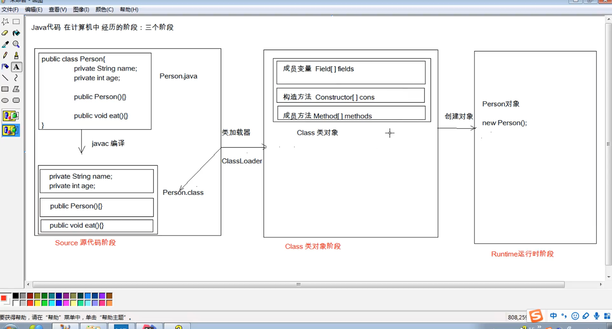
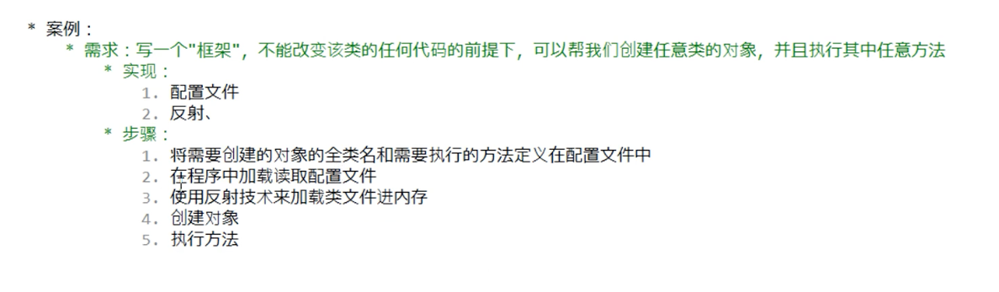

# JavaSE收尾

# junit单元测试
 

# 反射
反射是框架设计的灵魂
概念: 将类的各个组成部分封装成其他对象,这就是反射机制

反射可以在程序运行中操作对象,可以解耦,提高可扩展性

## 获取class类对象的方式
阶段1: Class.forName('包名.类名')    将字节码文件加载进内存,返回class对象  //多数用于配置文件,将类名定义在配置文件中,读取文件,加载类
阶段2: 类名.class // 多用于参数的传递
阶段3: 对象.getClass 在Object类中定义的类,所有对象都有这个方法 // 多用于对象的获取字节码方式
同一个字节码文件,在一次运行中,只会加载一次,通过任何形式获取的class对象,都是同一个


## 使用class类对象
### 方法
+ 获取方法
    - 获取成员变量
        1. Field[] getFields 获取所有public修饰的成员变量 
        2. Field getField 获取指定名称的public成员变量
        3. Field[] getDeclaredFields 获取所有成员变量,不考虑修饰符 PS:访问私有的变量,需要忽略访问权限修饰符的安全检查 setAccessible(true) 暴力反射
        4. Field getDeclaredField  获取所有成员变量,不考虑修饰符
    - 获取成员方法
        1. Methods[] getMethods 三个要素参数,方法名,方法参数类型的class的可变参数
        2. Methods getMethod
        3. Methods[] getDeclaredMethods
        4. Methods getDeclaredMethod
    - 获取构造方法
        1. Constructor<?> getConstructor getConstructor(String.class,Int.class)参数是构造方法参数类型的class
        2. Constructor<?> getConstructor
        3. Constructor<?> getDeclaredConstructor
        4. Constructor<?>[] getDeclaredConstructors
    - 获取类名
        1. String getName 获取类名,全类名的
+ Field 成员变量
    - get 获取值的方法 参数是要获取的对象
    - set 设置值的方法 参数是给哪个对象设置,设置的值是什么
+ Constructor 构造方法
    - T newInstance 创建对象 如果使用空参创建对象,可以省略操作,可以使用Class.newInstance方法
+ Methods 执行方法
    - invoke 参数是真实的对象,和方法的实际参数列表
    - getName 获取方法名称,返回名称的字符串

## 反射案例 
参考github链接


``` java
public class demo1 {
  public static void print(Printable p){
    p.print("hello");
  }
  public static void main(String[] args) throws Exception {
    // 创建持久化集合
    Properties pro = new Properties();
    // 获取classloader 使用 getResourceAsStream获取文件并且返回一个输入流
    ClassLoader classLoader = demo1.class.getClassLoader();
    InputStream resourceAsStream = classLoader.getResourceAsStream("pro.properties");
    // 读取文件,参数是一个输入流
    pro.load(resourceAsStream);
    // 获取数据文件中定义的数据
    String className = pro.getProperty("className");
    String methodName = pro.getProperty("methodName");
    // 加载该类进内存
    Class aClass = Class.forName(className);
    // 创建对象
    Object obj = aClass.newInstance();
    Method methods = aClass.getMethod(methodName,String.class);
    methods.invoke(obj,"333");
  }
}
```

# 注解
概念:也叫元数据,一种代码级别的说明,JDK1.5之后提供的特性,与类,接口,枚举同一层次,对元素进行说明,描述
作用: 
1. 编译检查 
2. 编写分档 生成doc文档,api文档
3. 代码分析 使用反射

使用注解: @符号 后面跟注解名称
学习目标:
1. jdk 预定义注解
2. 自定义注解
3. 在程序中使用注解(解析注解)

## JDK预定义内置注解
1. @Override 检测被注解的方法是否继承自父类(接口)
2. @Deprecated 该注解标注的内容,已过时
3. @SuppressWarnings 压制警告 需要传参,一般传递String "all"

## 自定义注解
1. 格式
元注解  例子: 
public @interface 注解名称{} 例子: public @interface MyInterface { }
反编译: javap 一个class文件
得到本质结果: public interface test extends java.lang.annotation.Annotation {}
注解本质上就是一个接口,默认继承Annotation

2. 注解中的属性(接口中可以定义的内容,常量,方法等) | 其实就是接口中的抽象方法
```java
public @interface MyInterface {
  public abstract String say();
}
//接口中能定义啥,注解中就能定义啥
```
属性:接口中的抽象方法
要求: 
1. 属性的返回值类型有以下取值类型,其余都不行
    - 基本数据类型 (四类八种)
    - 字符串String
    - 枚举
    - 注解
    - 数组(以上类型的数组)
2. 定义的属性,在使用时,需要给属性赋值
3. 使用default默认值,就可以不用赋值
``` java
public @interface MyInterface {
  public abstract String age() default "333";
}
```
4. 如果只有一个属性需要赋值,并且属性的名称叫做value,则赋值的时候可以直接定义值
``` java
package demo1;

public @interface MyInterface {
  public abstract String value() ;
}
 @MyInterface("22")
```

5. 数组赋值时,使用大括号赋值,如果数组中只有一个值.可以省略大括号

## 元注解
表示用于描述注解的注解,本质上还是个注解
@Target 描述注解能够作用的位置
@Retention 描述注解能够保留的阶段
@Documented 描述注解是否被抽取到api文档中
@Inherited 描述注解是否被子类继承


1. @Target
- ElementType 取值 
    + TYPE 作用于类上
    + METHOD 作用方法上
    + FIELD 作用于成员变量上

``` java
@Target(value = {ElementType.TYPE}) // 表示这个直接只能作用于类上
public @interface MyInterface {
  public abstract String value() ;
}
```
2. @Retention 阶段 (一般自定义注解都使用第三个runtime值)
- source
- class 会被jvm读取到
- runtime  
``` java
@Retention(RetentionPolicy.RUNTIME)
@Target({ElementType.TYPE,ElementType.METHOD,ElementType.FIELD})
public @interface MyInterface {
  public abstract String value() ;
}
```

## 使用注解
使用注解主要是获取注解中定义的属性值 
1. 获取注解定义位置的对象,class method,field
2. 获取注解 getAnnotation(Class)
3. 调用注解的抽象方法,获取配置的属性值
### 解析注解
```java
@Pro(className = "demo1.test1",MethodName = "pringMe")
public class demo1 {
  public static void main(String[] args) throws Exception {
  // 1. 解析注解
    Class<demo1> demo1Class = demo1.class;
    // 2. 获取注解对象
    Pro annotation = demo1Class.getAnnotation(Pro.class);//在内存中生成了一个该注解接口的子类实现对象
    // 3. 调用注解中定义的抽象方法,获取返回值
    String className = annotation.className();
    String MethodName = annotation.MethodName();

  }
}
```

使用注解完成上述案例
``` java
import java.lang.reflect.Method;
import java.util.Properties;
@Pro(className = "demo1.test1",MethodName = "pringMe")
public class demo1 {
  public static void main(String[] args) throws Exception {
  // 1. 解析注解
    Class<demo1> demo1Class = demo1.class;
    // 2. 获取注解对象
    Pro annotation = demo1Class.getAnnotation(Pro.class);//在内存中生成了一个该注解接口的子类实现对象
    // 3. 调用注解中定义的抽象方法,获取返回值
    String className = annotation.className();
    String MethodName = annotation.MethodName();
    Class aClass = Class.forName(className);
    Object obj = aClass.newInstance();
    Method methods = aClass.getMethod(MethodName,String.class);
    methods.invoke(obj,"333");
  }
}

```

## 注解的好处
class对象.isAnnotationPresent 判断当前方法上有没有指定的注解被加上了

获取文件的路径 
类名.class.getClassLoader().getResource("test.xml").getPath();